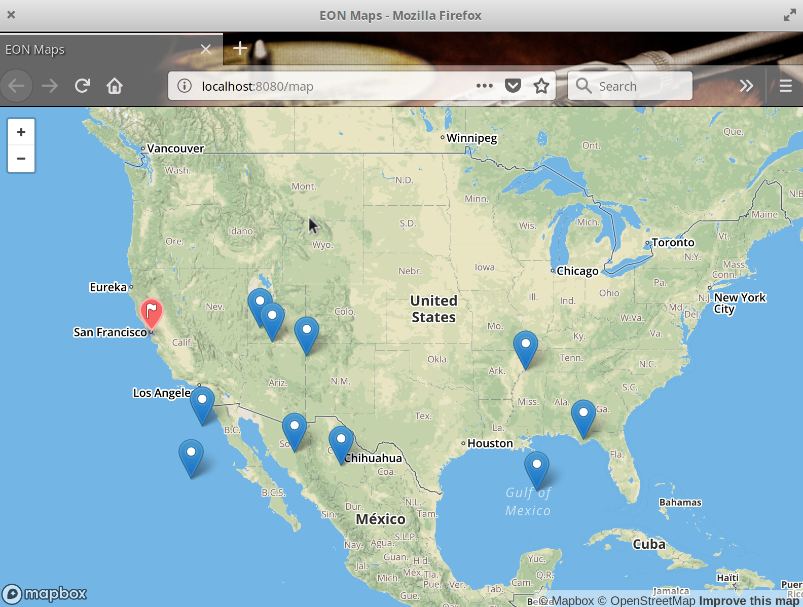

# How to run the demo

# Run PostgreSQL

You need a version that has logical decoding enabled. 
Use docker: 
```
docker run -p5432:5432 -it brechtian-docker-images.bintray.io/brecht/postgresql:12.2 
```

# Connect to database

Connect to database using (some GUI).
```
port = 5432
host = localhost
database = docker 
user = docker
password = docker
```

# Create table

```

DROP TABLE IF EXISTS "public"."users";
CREATE TABLE "public"."users" (
  "id" int4 NOT NULL,
  "lat" float8 NOT NULL,
  "lng" float8 NOT NULL
);

ALTER TABLE "public"."users" ADD CONSTRAINT "users_pkey" PRIMARY KEY ("id");
```


# Look at map , see updated in REAL TIME
```
sbt run
```

Open browser at http://localhost:8080/map

# Insert Random Data

Insert a random user:
```
INSERT INTO users VALUES(floor(random()*1024), floor(random()*(40-25+1))+25, -1 * (floor(random()*(120-80+1))+80));
```

# Enjoy


